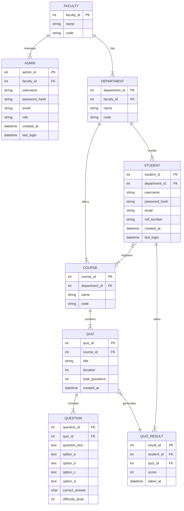

# Quiz Master Pro: Comprehensive Mobile Application Project

## Table of Contents
1. [Project Overview](#project-overview)
2. [Key Features](#key-features)
3. [System Architecture](#system-architecture)
4. [Database Design](#database-design)
5. [Key Database Features](#key-database-features)
6. [Flutter Application Structure](#flutter-application-structure)
7. [Additional Features and Suggestions](#additional-features-and-suggestions)
8. [Security Considerations](#security-considerations)
9. [Testing Strategy](#testing-strategy)
10. [Deployment Recommendations](#deployment-recommendations)

## 1. Project Overview

Quiz Master Pro is a sophisticated mobile application designed for educational institutions to manage quizzes across various departments and courses. It features a hierarchical structure of faculty, departments, and courses, with different user roles including super admins, sub-admins (admission branch), and students. This project aims to transform the original C++ terminal-based application into a robust, scalable, and user-friendly mobile platform.

## 2. Key Features

- **User Roles**: Super admins, sub-admins, and students
- **Hierarchical Structure**: Faculty > Departments > Courses
- **Self-registration** for students
- **Admin-managed** student enrollment
- **Course registration** for students within their department
- **Dynamic quiz** creation and management
- **Real-time quiz** taking and automated scoring
- **Performance analytics** and reporting

## 3. System Architecture

### a. Presentation Layer
- Mobile application built with Flutter
- Potential for future web and desktop expansion

### b. Business Logic Layer
- User authentication and authorization
- Quiz management and generation
- Course and department management
- Student enrollment and course registration
- Quiz validation and scoring

### c. Data Layer
- SQL database (recommended: PostgreSQL for its advanced features)
- Stores all system data: users, quizzes, results, etc.

## 4. Database Design

### Entity-Relationship Diagram



## 5. Key Database Features

### a. Stored Procedures
- `EnrollStudent(student_info, department_id)`
- `RegisterCourse(student_id, course_id)`
- `CreateQuiz(course_id, quiz_info)`
- `GetRandomQuizQuestions(quiz_id, num_questions)`
- `CalculateQuizResult(student_id, quiz_id)`

### b. Triggers
- After inserting a new quiz result, update student's overall statistics
- Before updating user data, log changes in an audit table
- After course registration, check for prerequisites and conflicts

### c. Views
- `StudentCourseView`: Shows courses a student is registered for
- `DepartmentPerformanceView`: Aggregates quiz results by department
- `CourseQuizStatisticsView`: Summarizes quiz performance for each course

## 6. Flutter Application Structure

```
lib/
├── main.dart
├── config/
│   └── app_config.dart
├── models/
│   ├── user.dart
│   ├── faculty.dart
│   ├── department.dart
│   ├── course.dart
│   ├── quiz.dart
│   └── question.dart
├── services/
│   ├── api_service.dart
│   ├── auth_service.dart
│   ├── database_service.dart
│   └── quiz_service.dart
├── screens/
│   ├── login_screen.dart
│   ├── registration_screen.dart
│   ├── admin_dashboard.dart
│   ├── student_dashboard.dart
│   ├── course_list_screen.dart
│   ├── quiz_list_screen.dart
│   └── quiz_screen.dart
├── widgets/
│   ├── course_card.dart
│   ├── quiz_card.dart
│   ├── question_card.dart
│   └── result_summary.dart
└── utils/
    ├── constants.dart
    └── helpers.dart
```

## 7. Additional Features and Suggestions

- Implement a **role-based access control** system to manage permissions for different user types
- Add a feature for admins to **create and manage departments and courses**
- Implement a **notification system** for new quizzes, results, and important announcements
- Create a **discussion forum** for each course where students can ask questions and interact
- Develop a feature for instructors to provide **feedback on quiz results**
- Implement **data analytics dashboards** for admins to track overall system performance
- Add support for **different question types** (multiple choice, true/false, short answer)
- Implement a feature for **timed quizzes** with auto-submit functionality
- Create a mobile-friendly **PDF generator** for quiz results and course completion certificates

## 8. Security Considerations

- Implement **JWT (JSON Web Tokens)** for secure authentication
- Use **HTTPS** for all API communications
- **Hash and salt** all passwords before storing in the database
- Implement **rate limiting** to prevent brute-force attacks
- Use **prepared statements** for all database queries to prevent SQL injection
- Implement proper **input validation and sanitization** on both client and server sides

## 9. Testing Strategy

- **Unit tests** for all backend services and database functions
- **Integration tests** for API endpoints
- **Widget tests** for Flutter UI components
- **End-to-end tests** simulating user flows (registration, taking a quiz, viewing results)
- **Performance tests** to ensure the system can handle expected user loads

## 10. Deployment Recommendations

- Use a cloud platform like **AWS, Google Cloud, or DigitalOcean** for hosting
- Implement a **CI/CD pipeline** for automated testing and deployment
- Use **containerization** (e.g., Docker) for consistent development and deployment environments
- Implement **database backups** and a disaster recovery plan
- Use a **content delivery network (CDN)** for faster global access to static assets

## Conclusion

The Quiz Master Pro mobile application project presents an excellent opportunity to create a comprehensive educational tool that leverages modern mobile and database technologies. By implementing this system, you'll gain valuable experience in mobile app development, database design, and system architecture – all highly sought-after skills in the job market.

This project allows for scalability and future enhancements, making it a robust foundation for an evolving educational platform. As you develop the application, remember to prioritize user experience, performance, and security to create a tool that truly adds value to the educational process.
