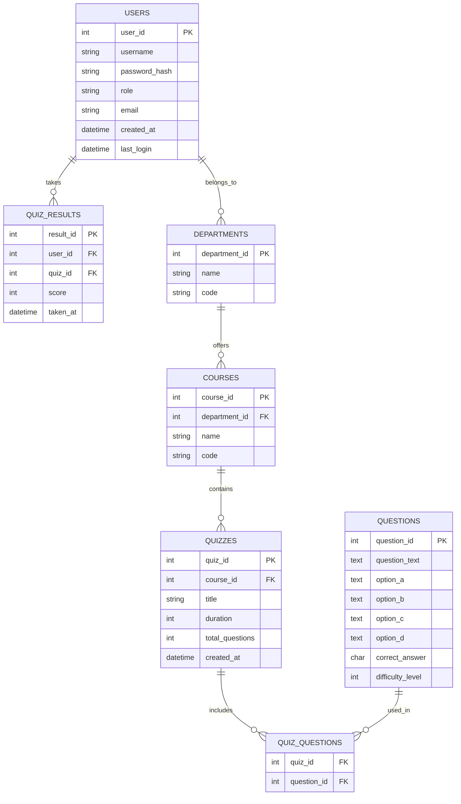

# Quiz Master Pro: Mobile Application Project

## Project Overview
This project aims to create an enhanced version of Quiz Master Pro, transforming it from a C++ terminal-based application into a mobile application with a robust backend database. The project will implement a three-tier architecture and serve as a learning opportunity for both database management and mobile app development courses.

## System Architecture

### 1. Presentation Layer
- A mobile application built using Flutter
- Potential for future expansion to web and desktop platforms

### 2. Business Logic Layer
- Responsible for:
  - Quiz loading
  - User authentication
  - Quiz validation
  - Score calculation

### 3. Data Layer
- SQL database (recommended: MySQL or PostgreSQL)
- Stores information about:
  - Users (admins, students)
  - Quiz questions
  - Quiz results
  - Courses and departments

## Database Design

### Entity-Relationship Diagram



### Key Database Features

1. Stored Procedures
   - EnrollStudent(student_info)
   - CalculateQuizResult(user_id, quiz_id)
   - GetRandomQuizQuestions(quiz_id, num_questions)

2. Triggers
   - After inserting a new quiz result, update the user's overall statistics
   - Before updating user data, log the changes in a separate audit table

3. Views
   - StudentQuizHistory: Shows all quizzes taken by a student with scores
   - CoursePerformance: Aggregates quiz results for each course
   - DepartmentStatistics: Summarizes performance across departments

## Flutter Application Structure

```
lib/
├── main.dart
├── config/
│   └── app_config.dart
├── models/
│   ├── user.dart
│   ├── quiz.dart
│   └── question.dart
├── services/
│   ├── api_service.dart
│   ├── auth_service.dart
│   └── database_service.dart
├── screens/
│   ├── login_screen.dart
│   ├── home_screen.dart
│   ├── quiz_list_screen.dart
│   └── quiz_screen.dart
├── widgets/
│   ├── question_card.dart
│   └── result_summary.dart
└── utils/
    ├── constants.dart
    └── helpers.dart
```

## Key Features
1. User Roles: Super admins, sub-admins, and students
2. Department and Course Management
3. Dynamic Question Bank
4. Randomized Quiz Loading
5. Real-time Quiz Taking and Scoring
6. Performance Analytics

## Security Considerations
- Implement proper authentication and authorization mechanisms
- Use prepared statements to prevent SQL injection
- Encrypt sensitive data in the database

## Testing Strategy
- Develop unit tests for database functions and API endpoints
- Create integration tests for the Flutter app

## Deployment Recommendations
Consider using cloud platforms like AWS, Google Cloud, or DigitalOcean for hosting the database and API.

## Future Enhancements
- Real-time leaderboards using websockets
- Data analytics dashboard for admins
- Offline mode for taking quizzes without an internet connection

## Conclusion
This project provides an excellent opportunity to gain hands-on experience with database management, mobile app development, and software architecture. The skills developed through this project are highly valuable in the job market and will provide a strong foundation for future software development endeavors.
